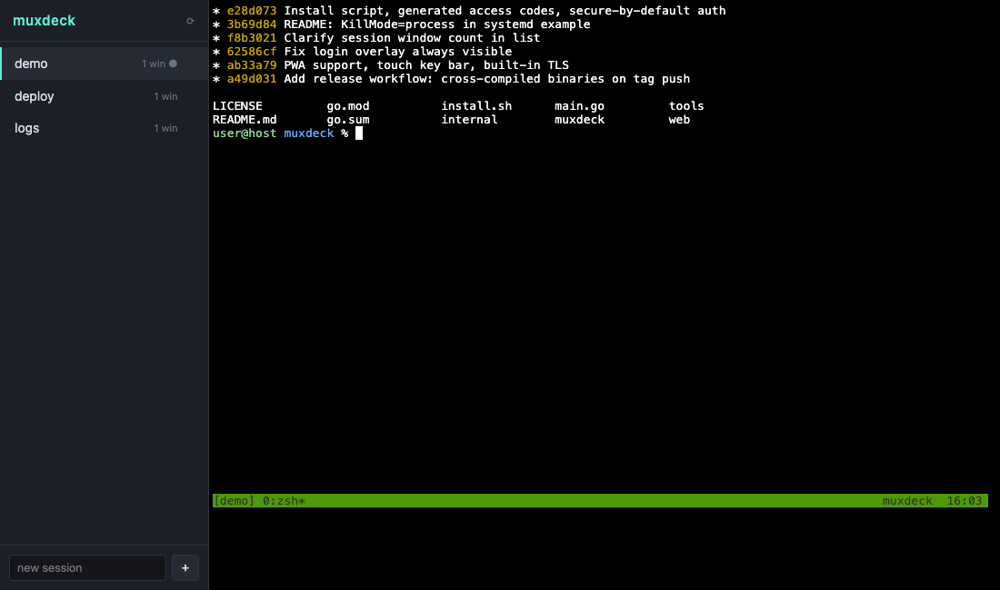

# muxdeck

A single-binary web app for creating, managing, and interacting with tmux
sessions from the browser.



- **Full terminal in the browser** — xterm.js attached to any tmux session
  over WebSocket; multiple viewers per session, just like multiple `tmux
  attach` clients
- **Split view** — two sessions side by side on wide screens; the deep-link
  hash carries both (`/#build,logs`)
- **Session management** — create, kill, rename, drag to reorder, unseen-output
  dots, and a fuzzy quick-switcher (`⌘K` / `Ctrl+Shift+K`)
- **Clipboard that works** — selection copies on release, tmux copy-mode
  yanks land on the system clipboard via OSC 52, and touch devices get a
  paste key; URLs in output are clickable
- **Resilient connections** — dropped WebSockets reconnect automatically
  with backoff (phones background tabs constantly; muxdeck just comes back)
- **Scrollback search** — find in the current session (`⌘F` /
  `Ctrl+Shift+F`), plus adjustable font size
- **One static binary** — frontend embedded, no runtime dependencies beyond
  `tmux` itself; Linux and macOS, amd64 and arm64
- **Installable PWA** — home-screen app on iPad/phone, with a touch key bar
  (esc / tab / sticky-ctrl / arrows / paste) for what software keyboards lack
- **Secure by default** — loopback binds are open; anything wider
  auto-generates an access code unless you configure a token or opt out;
  optional built-in TLS

## Install

```sh
curl -fsSL https://raw.githubusercontent.com/josecarlosrivas/muxdeck/main/install.sh | sh
```

The installer detects your platform, checks for tmux, downloads the latest
release binary, and offers three modes: try it in the foreground, install it
as a service (systemd/launchd, token-protected, starts at boot), or just put
the binary on your PATH. Non-interactive use:
`MUXDECK_MODE=service sh install.sh` (also `MUXDECK_BIN_DIR`, `MUXDECK_PORT`).

## Build

```sh
go build -o muxdeck .
```

The web frontend (including vendored xterm.js) is embedded in the binary —
deploying is copying one file.

Prebuilt binaries for linux/darwin × amd64/arm64 are attached to each
[release](../../releases).

## Run

```sh
./muxdeck                          # http://127.0.0.1:8300, no auth (loopback)
./muxdeck -addr 0.0.0.0:8300       # all interfaces — access code auto-generated
./muxdeck -addr 0.0.0.0:8300 -token s3cret   # fixed token instead
./muxdeck -addr 0.0.0.0:8300 -no-auth        # explicitly disable auth
./muxdeck -tls-cert cert.pem -tls-key key.pem  # serve HTTPS directly
```

**Auth is secure by default.** Binding beyond loopback without a `-token`
generates a 6-character access code, printed at startup:

```
access code: XK7M2P   (set your own with -token, disable auth with -no-auth)
```

Enter it on the unlock screen (case-insensitive) — GitHub-device-auth style.
A new code is generated each start; use `-token` for a stable secret, or
`-token auto` to force a code even on loopback. Startup also prints the URLs
the server is reachable at, one per interface on wildcard binds.

Every flag has an env-var default: `MUXDECK_ADDR`, `MUXDECK_TOKEN`,
`MUXDECK_NO_AUTH`, `MUXDECK_TLS_CERT`, `MUXDECK_TLS_KEY`.

muxdeck talks to the default tmux server of the user it runs as. Sessions
created and killed in the UI are real tmux sessions — anything you can do in
`tmux attach` works in the browser terminal, including multiple simultaneous
viewers of one session.

**Scrolling:** browsers only route wheel/touch scrolling into the terminal
when tmux mouse mode is on, so muxdeck enables `mouse on` for sessions it
creates, and the per-pane `mouse` button toggles it per session (it's the
real tmux option, so it affects terminal clients of that session too).

**Copy/paste:** selecting text copies it to the clipboard on release (with
mouse mode on, hold Shift — Option on macOS — to select in the browser
instead of tmux). tmux copy-mode yanks reach the system clipboard too:
muxdeck sets the server's `set-clipboard` option and the `Ms` terminfo
override, and the frontend turns the resulting OSC 52 writes into browser
clipboard writes. Paste with `⌘V`/`Ctrl+V`, or the `paste` key on touch
devices. Clipboard access needs a secure context (HTTPS or localhost).

**Keyboard shortcuts:** `⌘K` (`Ctrl+Shift+K`) fuzzy session switcher,
`⌘F` (`Ctrl+Shift+F`) find in scrollback. Plain Ctrl combos always go to
the terminal.

## Deployment

muxdeck is a single plain HTTP(S) server with no external dependencies, so it
composes with whatever infrastructure you already have. Common shapes:

- **Localhost only** (default): `./muxdeck`, open http://127.0.0.1:8300.
- **Private network / VPN / overlay network** (WireGuard, Tailscale, Nebula,
  …): bind to the private interface and rely on network access control;
  add `-token` for defense in depth. Mesh tools with a TLS-fronting feature
  (e.g. `tailscale serve`) can provide HTTPS without touching muxdeck.
- **Built-in TLS**: pass `-tls-cert`/`-tls-key` (any PEM pair — your own CA,
  Let's Encrypt via certbot, mkcert for LAN). No proxy required.
- **Reverse proxy**: put muxdeck behind Caddy/nginx/Traefik for automatic
  certificates and hostname routing. WebSockets pass through standard proxy
  configs; e.g. Caddy needs only:

  ```
  mux.example.com {
      reverse_proxy 127.0.0.1:8300
  }
  ```

- **Supervision**: any process manager works. systemd example:

  ```ini
  [Unit]
  Description=muxdeck
  After=network.target

  [Service]
  User=youruser
  Environment=MUXDECK_ADDR=0.0.0.0:8300 MUXDECK_TOKEN=changeme
  ExecStart=/usr/local/bin/muxdeck
  Restart=on-failure
  # Without this, restarting/stopping muxdeck kills the whole cgroup —
  # including the tmux server it spawned, and every session in it.
  KillMode=process

  [Install]
  WantedBy=default.target
  ```

  On macOS, a `launchd` plist pointing at the binary does the same job.

## iPad / phone (PWA)

muxdeck installs as a Progressive Web App: serve it over HTTPS (any option
above), open it in the browser, and use "Add to Home Screen" — you get a
full-screen terminal with the muxdeck icon. On touch devices a key bar
(esc / tab / sticky-ctrl / arrows / common symbols) appears above the
terminal to cover what software keyboards lack; hardware keyboards work
as-is.

Note: service workers (and therefore installation) require a secure context —
HTTPS or localhost. Plain-HTTP deployments still work in a normal browser
tab, including the key bar.

## Security model

A browser terminal is remote code execution by design. Deploy accordingly:

- **Loopback binds** run without auth. **Any other bind** gets a generated
  access code unless you set `-token` or explicitly pass `-no-auth`.
- **Trusted/private network:** network access control may be enough — use
  `-no-auth` if you accept that, or keep the code/token as defense in depth.
- **Anything less trusted:** use a `-token` and serve over TLS (built-in
  flags or a proxy). The token gates all `/api` routes; the login form sets
  an HttpOnly cookie, and non-browser clients can send
  `Authorization: Bearer <token>`.
- WebSocket upgrades enforce a same-host `Origin` check to block cross-site
  hijacking.

Never expose muxdeck directly to the public internet without both TLS and a
token.

## API

| Method | Path                          | Description                     |
|--------|-------------------------------|---------------------------------|
| POST   | `/api/login`                  | `{"token"}` → HttpOnly cookie   |
| GET    | `/api/sessions`               | list sessions                   |
| POST   | `/api/sessions`               | `{"name"}` → create (detached)  |
| DELETE | `/api/sessions/{name}`        | kill session                    |
| POST   | `/api/sessions/{name}/rename` | `{"name"}` → rename             |
| GET    | `/api/sessions/{name}/mouse`  | `{"enabled"}` — tmux mouse mode |
| POST   | `/api/sessions/{name}/mouse`  | `{"enabled"}` → set mouse mode  |
| GET    | `/api/sessions/{name}/attach` | WebSocket terminal bridge       |

Attach protocol: client sends JSON text frames `{"type":"input","data":"…"}`
and `{"type":"resize","cols":N,"rows":N}`; server sends raw terminal output as
binary frames.

Session names are restricted to `[A-Za-z0-9_-]{1,64}`.

## How it works

muxdeck shells out to the `tmux` CLI of the user it runs as — it holds no
session state of its own. Each WebSocket attach spawns a real `tmux
attach-session` client on a PTY and pipes bytes both ways, so everything
tmux can do (splits, scrollback, copy mode, status line) just works. If you
start muxdeck from inside a tmux session it manages that same tmux server;
otherwise the user's default server.

## Development

```sh
go run .                      # serve with live web/ from the embedded FS
go run ./tools/genicons web/icons   # regenerate PWA icons (stdlib only)
```

Plain `go build` produces the deployable binary. CI runs `go vet`, a build,
and a `gofmt` check on every push and PR.

## License

[MIT](LICENSE)
